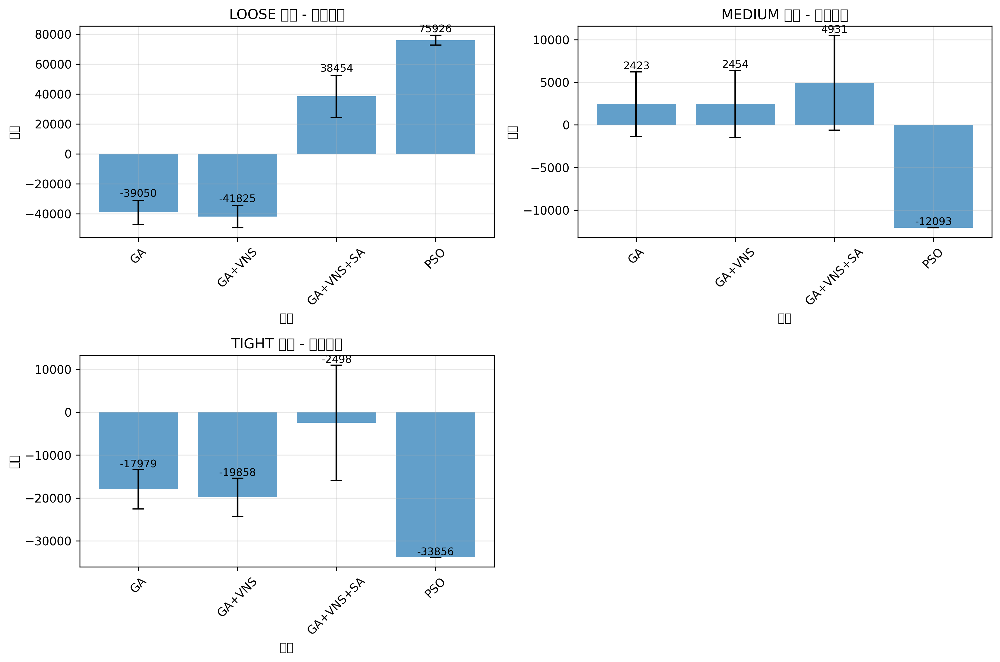
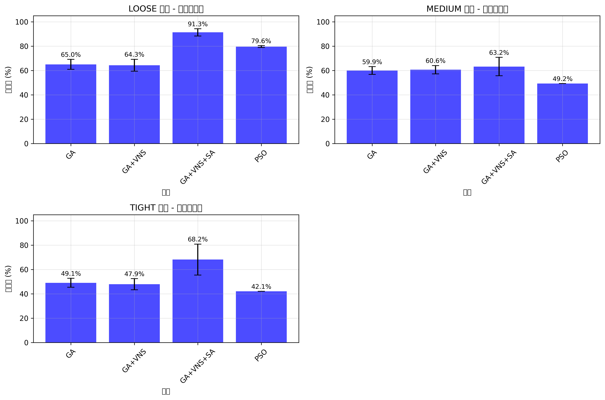
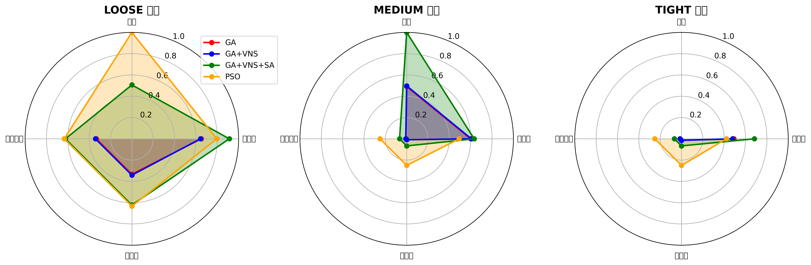

# 强化适应度驱动的生产线调度优化：多场景下的算法比较与复现

作者：你的姓名（单位）
日期：2025-11-12

## 摘要
我们研究了生产线调度中以交付期限为核心约束的优化问题，针对低准时率与高罚金的痛点，提出并系统验证了“强化适应度函数”（提高截止权重与软惩罚系数）的有效性。在 LOOSE/MEDIUM/TIGHT 三类订单紧迫度场景下，我们对 GA、GA+VNS、GA+VNS+SA、PSO 四种算法进行了三场景×30 次实验，比较了利润、产线利用率、准时率与罚金率，并进行了相对 GA 的配对 t 检验。结果表明：强化适应度策略显著提升了准时率并降低罚金（多场景显著）；PSO 在期限遵守方面表现稳定与优越（MEDIUM/TIGHT 场景准时率提升、罚金率显著降低，标准差趋零），而 GA+VNS+SA 在利用率与利润方面更具均衡性。我们开源了数据与脚本，并给出了参数调整时的最小重跑流程，确保结论可复现。

## 1 引言
生产线调度需要同时平衡交付期限与生产成本/效率。传统 GA 在复杂约束下易出现低准时率与高罚金。本文的贡献包括：提出强化适应度函数以突出期限约束，构建多场景（LOOSE/MEDIUM/TIGHT）评价基准，系统比较 GA 家族与 PSO，给出可复现的实验与统计流程。

## 2 方法
### 2.1 指标定义
- 利润（Profit）、利用率（Utilization Rate）、准时率（On‑time Rate）、惩罚率（Penalty Rate）。

### 2.2 强化适应度函数
通过提高截止权重与软惩罚系数（示例超参数如 `alpha_deadline`、`beta_late_units`），在搜索早期对晚交货强抑制，引导解朝向“更少迟交、更高准时率”的区域；软惩罚的连续刻画利于 GA/VNS/SA 在复杂解空间中持续前进。

### 2.3 算法配置
- GA、GA+VNS、GA+VNS+SA、PSO；解码策略采用 EDD；PSO 随机源受 `--seed` 控制以实现复现。

## 3 实验设置
- 场景：LOOSE / MEDIUM / TIGHT；每算法每场景 n=30。
- 数据与脚本：
  - 汇总数据：`experiments/batch_*_m6s3_summary.csv`
  - 统计与绘图：`experiments/scripts/aggregate_m8_batches.py`、`compute_m8_averages.py`、`compute_m8_tests.py`、`plot_m8_figures.py`
- 显著性：相对 GA 的配对 t 检验（符号 ns/*/***）。

## 4 结果与分析
图表与数值表如下（文件相对路径可直接引用）：

图1（利润对比）：

图2（利用率对比）：

图3（准时率对比）：

图4（综合性能雷达图）：

表1（数值摘要与显著性）：
[M8 数值摘要表（均值±标准差与配对t检验）](figures/m8_plots/m8_summary_table.md)

关键发现（摘要）：
- LOOSE：PSO 与 GA+VNS+SA 在准时/罚金上显著优于 GA；PSO 利润最高，GA+VNS+SA 利用率最高。
- MEDIUM：PSO 显著提高准时率/降低罚金，但在当前参数下牺牲了利用率与利润；GA+VNS+SA 相对 GA 有小幅显著改善。
- TIGHT：PSO 与 GA+VNS+SA 均显著改善准时/罚金；PSO 准时率最高但利润最低；GA+VNS+SA 在利润/利用率上优于 GA。

## 5 讨论
强化适应度在不同场景均提升期限遵守；PSO 的标准差趋零反映当前参数与解码稳定最优（非未注入随机性）。若需探索随机性或参数（`w/c1/c2/max_vel`），建议仅重跑 PSO 三场景×30 次并重新聚合与统计。

## 6 结论与未来工作
当交付及时性为首要目标时推荐 PSO；当利润与资源利用为优先时推荐 GA+VNS+SA。未来将扩展到多目标、动态订单、更多资源约束与实时调度。

## 参考与复现
- 数据与场景：`data/scenarios/*.json`
- 汇总数据：`experiments/batch_*_m6s3_summary.csv`
- 统计与绘图脚本：`experiments/scripts/*.py`
- 最小重跑：仅当 PSO 参数/随机性改变时，重跑三场景×30 次 → 运行聚合与统计 → 同步表格与图。

参考文献（占位）：Kennedy & Eberhart (PSO, 1995)；Holland (GA, 1975)；Mladenović & Hansen (VNS, 1997)。