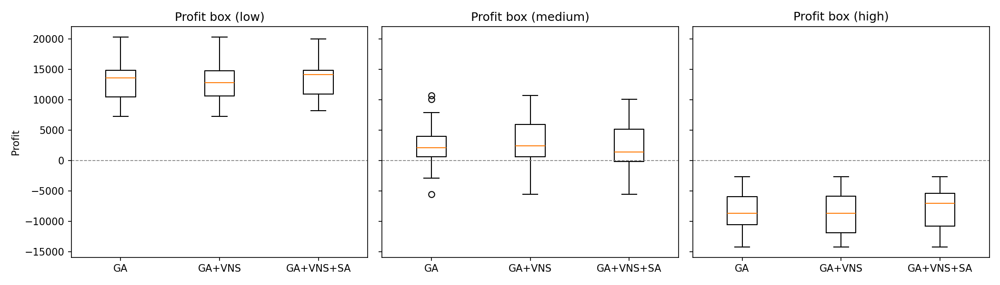
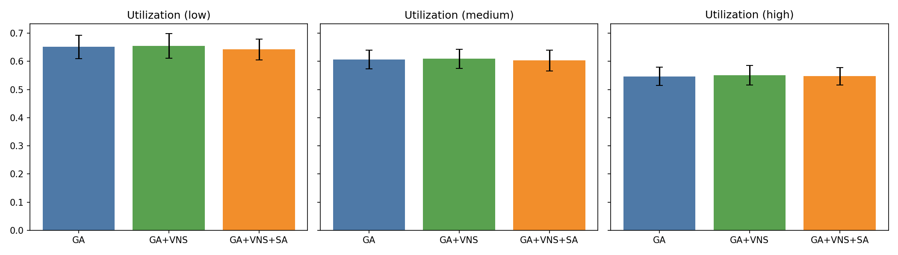
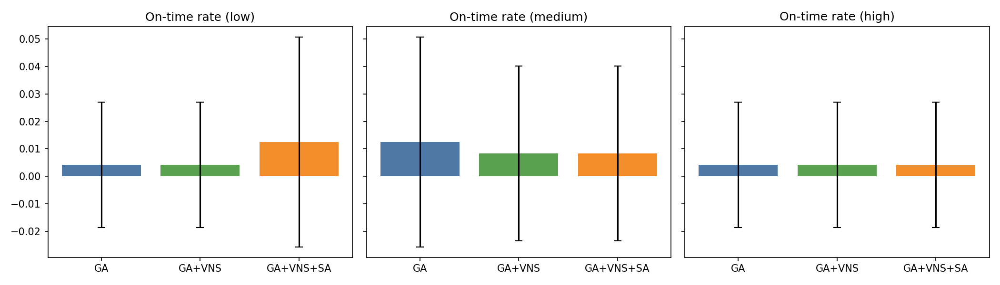
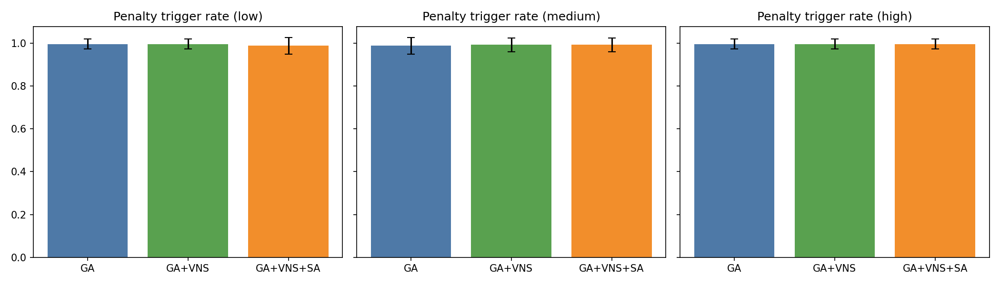

# 计算智能大作业：智能制造生产计划与调度 设计与实现方案

## 1. 任务概述

- 目标：在“每日早上8点统一排程”的机制下，为三条相同生产线和三种产品制定跨天生产调度，最大化企业利润（订单收入 − 生产成本 − 工资成本 − 罚款）。
- 场景要点：
  - 三条生产线能力相同；产品切换仅允许发生在每个4小时时段边界；原材料无限；工人按4小时结算且越偏离正常工作时间工资越高；
  - 订单在8点之后到来则次日统一安排；合同截止时间均为截止日期当日的早上8点；未按时完成订单需缴纳订单总金额10%的罚款；
  - 可将同一类产品的各订单“最后不足4小时”的加工量合并在同一时段内处理。
- 关键挑战：
  - 利润最大化与准时率、工资（时段）成本之间的平衡；
  - 订单到期约束与产线时段容量匹配；
  - 离散时段（4小时）下的产品指派与订单内分配的协同优化；
  - 算法需兼顾全局搜索与局部精细优化。

## 1.1 面向初学者：我们在做什么（通俗版）

- 一句话概述：我们要在“每天的6个时段×3条产线”里，安排每个时段、每条线生产哪种产品和多少产量，让企业的总利润（收入 − 生产成本 − 工资成本 − 罚金）尽可能高，同时尽量按期完成订单。
- 场景故事：
  - 工厂每天有6个固定时段（每段4小时），工人按时段结算工资，夜班更贵；订单有到达时间和截止日期，超过截止就要罚款；同产品的零碎加工可以在同一时段合并处理。
- 我们的输入与输出：
  - 输入（两份JSON）：
    - `data/config.json`：产线数量、各产品的生产速率与单位成本、每时段的工资系数等；
    - `data/orders.json`：订单列表（产品、数量、单价、到达日、截止日）。
  - 输出（一个运行目录）：
    - `experiments/run-YYYYMMDD_HHMMSS_<tag>_seed<SEED>/`，内含：
      - `schedule.json`：每时段每条线生产的产品（或空闲）；
      - `metrics.json`：指标（见下“指标名对照表”）；
      - `summary.md`：本次关键参数与结果摘要；同时保留输入快照 `config.json` 与 `orders.json`。
- 系统如何工作（流水线视角）：
  1) 读入配置和订单；
  2) 用遗传算法（GA）生成一批“调度方案”候选（每个候选就是一个完整的时段×产线排程）；
  3) 对每个候选，用解码器（EDD+利润密度）把“时段产量”细分到各订单（优先最早到期、同到期看单位利润密度）；
  4) 计算指标（收入、生产成本、工资、罚金、准时率、利用率等）；
  5) 选择更好的候选，不断交叉与变异迭代，得到更优调度；在后续版本（M3）会加局部搜索（VNS/ILS）做精细微调。
- 为什么这事不简单：
  - 目标冲突：夜班工资高但能赶工，白天工资低但容易不够用；加快生产能提升准时率，但可能增加成本；
  - 离散时段约束：只能在4小时边界切换产品，导致“早/晚一点”的移动变成结构化的块移动；
  - 订单分配协同：时段产量必须在多订单之间分配，既要尽量不超容量，又要兼顾到期与收益。
- 指标名对照表（英文 → 中文）：
  - `profit`（利润）、`total_revenue`（总收入）、`production_cost`（生产成本）、
    `wage_cost`（工资成本）、`penalty`（罚金）、
    `utilization_rate`（产线利用率）、`on_time_rate`（准时率：按期且全部完成的订单比例）、
    `penalty_rate`（罚款触发率：未按期或未完整交付的订单比例）、
    `delivered_per_order`（订单交付件数字典）。
- 如何复现（最小示例）：
  - 单次运行：
    - `python -m src.main --horizon 7 --generations 300 --pop 100 --pc 0.9 --pm 0.12 --config data/config.json --orders data/orders.json --out results --runs_dir experiments --exp_tag ga-enhanced --seed 303`
  - 批量运行：
    - `python -m src.experiments.runner --exp_tag ga-enhanced --seed-start 201 --seed-end 205 --horizon 30 --generations 300 --population 100 --crossover 0.9 --mutation 0.12 --config data/config.json --orders data/orders.json --outdir results --runs_dir experiments`

> 初学者可先理解：我们在用“进化”的方式迭代调度表（什么时候哪条线做哪个产品），再按订单规则分配产量，最后看利润与各项指标有没有变好。

## 2. 问题建模

### 2.0 默认初始数据（数值确定版）

- 产线与时段设置（与当前实验数据一致）：
  - 产线数 `L = 3`；每天离散为 6 个时段：`[8-12], [12-16], [16-20], [20-24], [0-4], [4-8]`；每时段长度 4 小时；计划视野 `H` 天，共 `S = 6 * H` 个时段。

- 产品参数（来自 `data/config.json`）：
  - 产品1：`rate_per_hour = 12`（件/小时），`unit_cost = 40`（生产成本/件）；每条线每时段容量 `Cap_1 = 4 * 12 = 48`（件）。
  - 产品2：`rate_per_hour = 10`（件/小时），`unit_cost = 35`；`Cap_2 = 4 * 10 = 40`（件）。
  - 产品3：`rate_per_hour = 8`（件/小时），`unit_cost = 30`；`Cap_3 = 4 * 8 = 32`（件）。
  - 说明：容量指“每条线在一个 4 小时时段最多能产的件数”。三条线同时生产同一产品时段的总容量为 `3 * Cap_p`。

- 工资设置（来自 `data/config.json`）：
  - 每条产线每时段基础工资：`wage_per_slot_per_line = 2000`（元）。
  - 工资系数（按 6 个时段依次）：`wage_multiplier_per_slot = [1.0, 1.1, 1.2, 1.35, 1.5, 1.3]`。
  - 单时段工资计算：若该时段启用 `ActiveLines_s` 条线，则
    - `W_slot = wage_per_slot_per_line * wage_multiplier_per_slot[s] * ActiveLines_s`。
    - 例：在 `[20-24]`（系数 1.35）时段启用 2 条线，`W_slot = 2000 * 1.35 * 2 = 5400（元）`。
  - “满负荷”每日工资（6 时段、3 条线均启用）：
    - 每日系数和 `Σw = 1.0 + 1.1 + 1.2 + 1.35 + 1.5 + 1.3 = 7.45`；
    - `W_day_full = 2000 * 7.45 * 3 = 44,700（元/日）`；
    - 视野 `H` 天的“满负荷工资上界”≈ `44,700 * H`（元）。

- 订单与罚金（规则固定）：
  - 收入（订单 k）：`Revenue_k = delivered_k * unit_price_k`（交付件数 × 单价）。
  - 罚金（订单 k）：若未在截止前“全部完成”，则
    - `Penalty_k = 0.1 * qty_k * unit_price_k`（合同额的 10%）。
    - 例：`qty=500, unit_price=110` 的订单未按期全部完成，`Penalty = 0.1 * 500 * 110 = 5,500（元）`。
  - 到达与截止：到达日当日 8 点后到来的订单，次日 8 点开始可安排；截止为截止日 8 点。

- 成本与利润（评估用的确定公式）：
  - 总收入：`total_revenue = Σ(delivered_k * unit_price_k)`。
  - 生产成本：`production_cost = Σ(产量件数 * unit_cost_product)`（按产出的具体产品计成本）。
  - 工资成本：`wage_cost = Σ_s (2000 * wage_multiplier_per_slot[s] * ActiveLines_s)`。
  - 总罚金：`penalty = Σ_k Penalty_k`（按规则触发）。
  - 总利润：`profit = total_revenue - production_cost - wage_cost - penalty`。
  - 样例核算（取 M1 批量均值以便直观理解）：
    - `total_revenue ≈ 408,300`，`production_cost ≈ 556,872`，`wage_cost ≈ 981,220`，`penalty ≈ 38,630`；
    - `profit ≈ 408,300 - 556,872 - 981,220 - 38,630 ≈ -1,168,422`（为负），说明在“夜间工资较高、罚金较多”的情况下，仅凭基线 GA 很难把利润推向非负；
    - 在 M2 增强后（夜间降活跃、窗口交叉、分层变异、修复器），`wage_cost` 与 `production_cost` 下降、`profit` 向零逼近，但仍需 M3 的截止导向局部搜索进一步降低 `penalty` 与提升 `on_time_rate` 才可能转正。

> 上述参数与公式均为当前实验所用的“确定数值”。如进行场景对比与敏感性分析，可在 `data/config.json` 中调整产品速率、单位成本与工资系数，并保持罚金比例为 10% 以利于横向比较。

### 2.1 时间窗与时段

- 每日离散成6个时段：`[8-12], [12-16], [16-20], [20-24], [0-4], [4-8]`；每时段长度4小时。
- 计划视野（滚动或静态）：设为 `H` 天，则总时段数 `S = 6 * H`。
  - 内联注释（默认取值）：本项目默认每日 6 时段、每段 4 小时；与 `data/config.json` 中的 `wage_multiplier_per_slot = [1.0, 1.1, 1.2, 1.35, 1.5, 1.3]` 一一对应。

### 2.2 产线与产品

- 产线数：`L = 3`（相同能力）。
- 产品数：`P = 3`。
- 生产率：`r_p`（件/小时，产品相关）；时段容量：`Cap_p = 4 * r_p`（每条线每时段）。
- 允许时段选择“空闲（Idle）”以节省高工资时段成本（可选）。
  - 内联注释（默认取值）：产品1 `r_1=12, c_1=40, Cap_1=48`；产品2 `r_2=10, c_2=35, Cap_2=40`；产品3 `r_3=8, c_3=30, Cap_3=32`；默认允许空闲（`allow_idle=true`）。

### 2.3 订单

- 订单 `k` 属性：产品 `p(k)`，总量 `q_k`，单价 `v_k`，截止日 `d_k`（以8点为截止时刻），到达日 `a_k`（在8点后到来的订单次日进入排程）。
- 收入：按交付件数结算 `Revenue_k = delivered_k * v_k`。
- 罚款：若 `delivered_k < q_k` 则罚款 `Penalty_k = 0.1 * q_k * v_k`。
  - 内联注释（默认取值）：罚金比例固定为合同额的 `10%`；到达规则与截止时间均按每日 `8:00` 计算（与当前实验一致）。

### 2.4 成本与收益

- 单位生产成本：`c_p`（产品相关的材料/制造成本，费用已包含其他管理成本）。
- 工资成本（按时段结算）：`W_slot = W_base * w_s * ActiveLines_s`。
  - `W_base`：每条产线在一个时段的基础工资；`w_s`：时段工资系数（越偏离正常工作时间越高）。
  - 正常工作时间近似为 `8:00-12:00, 13:00-17:00`，我们用时段系数近似离散化：例如 `w = [1.0, 1.1, 1.2, 1.35, 1.5, 1.3]` 对应上述6个时段（可在配置中调整）。
  - 内联注释（默认取值）：`W_base=2000`（元/线·时段），满负荷每日工资约 `44,700`（`6` 时段 × `3` 条线 × 系数和 `7.45`）。总利润评估采用 `profit = total_revenue - production_cost - wage_cost - penalty`。

### 2.5 合并加工规则

- 同一种产品的多个订单若各自“最后不足4小时”的剩余可在同一时段合并加工，只要总合计不超过该时段容量 `Cap_p`。
  - 内联注释（默认取值）：容量上界按产品计：`Cap_1=48`、`Cap_2=40`、`Cap_3=32`（均为“每线每时段”）。

### 2.6 符号说明

- `x_{l,s,p}`：第 `l` 条线在时段 `s` 生产的产品 `p` 的件数（整型，0..`Cap_p`）。
- `y_{l,s,p}`：第 `l` 条线时段 `s` 选择产品 `p` 的二元变量（每时段每线恰选一个产品或空闲）。
- `delivered_{k}`：订单 `k` 在其截止时刻前累计完工的件数。
- `ActiveLines_s`：时段 `s` 实际生产的产线数量（空闲不计入）。
  - 内联注释（默认取值对应）：`Cap_p` 取 `Cap_1=48`、`Cap_2=40`、`Cap_3=32`；`W_base=2000`；`w_s` 按 `[1.0, 1.1, 1.2, 1.35, 1.5, 1.3]`；若空闲允许则 `allow_idle=true`。

## 3. 数学模型（用于评估与约束校验）

### 3.1 决策变量与约束

- 产品选择约束（每线每时段最多一个产品或空闲）：`sum_p y_{l,s,p} ≤ 1`。
- 产能约束：`x_{l,s,p} ≤ Cap_p * y_{l,s,p}`，`x_{l,s,p} ≥ 0` 且为整数。
- 时段切换约束：仅在时段边界可发生产品变化（隐含在时段离散化中）。
- 订单完工统计：`delivered_{k} = sum_{l,s: s ≤ deadline(k)} assign_{l,s,p(k),k}`，其中 `assign` 为将时段产量分配到各订单的解码量。
- 到达约束：若订单 `k` 在日 `a_k` 的8点后到达，则仅从次日8点开始计入可分配时段。

### 3.2 收益/成本与目标函数

- 总收入：`Revenue = sum_k (delivered_k * v_k)`。
- 生产成本：`ProdCost = sum_{l,s,p} (x_{l,s,p} * c_p)`。
- 工资成本：`WageCost = sum_s (W_base * w_s * ActiveLines_s)`。
- 罚款：`Penalty = sum_k [I(delivered_k < q_k) * (0.1 * q_k * v_k)]`。
- 目标：最大化总利润 `Profit = Revenue - ProdCost - WageCost - Penalty`。

备注：罚款按是否“如期全部完成”触发，支持部分交付计收入；该目标可直接用于元启发式的适应度评估。

## 4. 解码与订单内分配策略

- 染色体通常仅决定“每线每时段生产哪种产品以及大致产量”，订单内分配通过解码器执行：
  - 规则：优先满足“最早到期（EDD）”的订单，若同到期则按“单位利润密度 `v_p - c_p`”由高到低分配；
  - 合并不足时段：同产品的多个订单剩余不足4小时的零星量在一个时段内合并，确保不超过容量；
  - 空闲策略：在工资系数高且订单紧迫度低的时段允许空闲以降低成本（可选，通过允许 `y_{l,s,Idle}=1`）。

## 5. 算法设计（使用已学算法并做混合）

### 5.1 总体框架

- 采用“遗传算法（GA） + 迭代局部搜索（ILS）/变邻域搜索（VNS） + 模拟退火（SA）/禁忌（TS）”的混合策略：
  - GA负责全局结构搜索（产品指派与产量粗分配）；
  - 解码器做订单内的细分配；
  - VNS/ILS对解码后解进行邻域微调（交换时段、移位、分裂/合并、跨线重分配）；
  - SA/TS作为二次局部优化器，跳出局部最优并记忆劣解禁忌；
  - 备选：PSO用于连续化产量比例的优化、ACO用于时段-产品序列的构造式搜索（做对比实验与消融）。

### 5.2 染色体编码

- 编码一：`[slot -> (line1_product, line2_product, line3_product)]` + 每时段每线的产量比例（0..1，后解码为整数件数）。
- 编码二：直接为每线每时段给出离散产量向量 `x_{l,s,p}`（推荐在后期局部搜索阶段操作）。

### 5.3 邻域操作

- 时段交换（同线或跨线）；
- 产品切换（局部更改某时段的产品选择）；
- 产量微调（在0..`Cap_p`间小幅增减）；
- 合并/分裂（将两个相邻时段的同产品产量重新分配以契合订单）；
- 跨线重分配（把同一时段的产量在不同线间移动以适应工资或产能差异）。

### 5.4 评估与选择

- 适应度：直接用 `Profit`；可叠加“软约束罚项”（如超容量、越期分配）以形成连续化惩罚。
- 选择/交叉/变异：
  - 选择：锦标赛或排序选择；
  - 交叉：基于时段块的交叉（按天或按时段窗口进行块交叉）；
  - 变异：随机更换某时段的产品、微调产量比例、插入空闲时段。
- 局部搜索：VNS在小/中/大邻域间切换，SA/TS试探更大胆移动并避免回退到近期解。

### 5.5 参数与终止条件（首版建议）

- GA：种群 `N=60-120`，交叉率 `pc=0.8`，变异率 `pm=0.1-0.2`，代数 `G=200-500`。
- VNS：邻域层数 `3-5`，每层尝试 `50-200` 次移动；
- SA：初温选基于初始解利润方差，降温 `α=0.95`，每温度步长 `100-300` 次；
- TS：禁忌表长度 `10-30`，迭代 `1000+` 次；
- 终止：最大迭代、时间上限（如 `10-30min`），或连续若干代改进不足。

### 5.6 截止与罚金软约束权重（M3 实施参考）

- 目标：在适应度中加入“截止/罚金相关的软罚项”，引导 GA+VNS/ILS 提前保障截止与留出缓冲，避免仅靠硬罚金在末期才触发。

- 软罚项设计（与金额同量纲）：
  - 截止超配软罚项（针对“安排到截止之后”的风险量）：
    - `SoftDeadline = Σ_k [ w_deadline * late_qty_k * v_k ]`
    - 其中 `late_qty_k` 为订单 `k` 被安排在 `s > deadline(k)` 的产量估计（若解码器不分配到期后订单，可按排程中该产品在截止后的产量作为风险占位量）；`v_k` 为单价。
    - 推荐权重：`w_deadline ∈ [0.05, 0.15]`（相对合同金额比例）。
  - 截止缓冲不足软罚项（针对“截止前可用容量不足”的结构性风险）：
    - `SoftSlack = Σ_k [ w_slack * max(0, demand_k - capacity_before_deadline_k) * v_k ]`
    - `demand_k = q_k`；`capacity_before_deadline_k` 为在 `s ≤ deadline(k)` 的总可用容量（按所选产品的 `Cap_p` 汇总）。
    - 推荐权重：`w_slack ∈ [0.02, 0.10]`。
  - 时间接近加权（越临近截止，越重）：
    - `w_deadline_slot(s) = base * γ(s)`，其中 `γ(s)` 可分段取值：远期 `1.0`、中期 `1.2`、临近截止 `1.5`、最后一天 `2.0`。

- 适应度整合：
  - `Fitness = Profit - λ_soft * ( SoftDeadline + SoftSlack )`
  - 推荐：早期 GA `λ_soft=0.5`，GA 收敛后 `λ_soft=1.0`，M3 局部搜索阶段 `λ_soft=1.5–2.0`。

- 实施提示：
  - `capacity_before_deadline_k` 可由解码前的容量上界估算，或解码中按 EDD 分配后的剩余缺口统计；
  - 通过乘以 `v_k`（单价）使软罚项单位为金额，便于与 `Profit` 同量纲直接相减；
  - 软罚项仅用于引导搜索方向；硬罚金仍按“未按期全部完成触发 10% 合同金额”严格结算。

- 场景化权重建议：
  - 基准：`w_deadline=0.08`、`w_slack=0.05`、`λ_soft=1.0`；
  - 紧迫（订单普遍接近截止）：`w_deadline=0.12`、`w_slack=0.08`、`λ_soft=1.5`；
  - 宽松（截止普遍宽裕）：`w_deadline=0.05`、`w_slack=0.02`、`λ_soft=0.5`。

## 6. 工程实现

- 语言与依赖：
  - `Python >= 3.10`；依赖 `numpy`, `pandas`, `scipy`, `matplotlib`, `seaborn`，可选 `numba` 加速；
- 目录结构（计划）：
  - `src/models/`：订单、时段、产线、配置的数据模型；
  - `src/decoders/`：EDD+利润密度解码器与合并策略；
  - `src/evaluation/`：利润计算、软约束罚项、指标统计；
  - `src/algorithms/ga.py`、`vns.py`、`sa.py`、`ts.py`、`pso.py`、`aco.py`；
  - `src/main.py`：CLI入口；
  - `data/`：订单/配置样例；`experiments/`：实验脚本与结果；
  - `paper/`：论文草稿与图表；
- CLI示例：
  - `python src/main.py --orders data/orders.json --config data/config.json --horizon 7 --algo hybrid`
  - 输出：调度方案（每时段每线产品与产量）、订单完成情况、利润与各项成本。

## 7. 实验设计

- 数据集：
  - 随机生成器：按产品率、单价、成本、到达/截止分布生成不同规模订单（小/中/大）；
  - 真实/半真实数据：若有提供；
- 指标：
  - 总利润、准时率（全部按时完成的订单比例）、罚款率（触发罚款的订单比例）、产线利用率、平均工资成本（每日/每时段）、单位利润密度；
- 对比：
  - GA（仅全局，不带LS）、GA+VNS、GA+SA、PSO、ACO、ILS/VNS、混合算法；
- 消融：
  - 不同解码策略（仅EDD vs EDD+利润密度 vs 加权）、是否允许空闲、工资系数取值敏感性；
- 统计：
  - 运行 `30` 次独立试验，报告均值±标准差；必要时做非参数检验（如Wilcoxon）。

### 实验结果（M6 阶段2）

- 设置：三种工资场景（低/中/高），算法 GA、GA+VNS、GA+VNS+SA，固定种子 `500–529`，每场景 `30` 次。
- 图表（paper/figures）：
  - 利润箱线图（低/中/高三子图）：
    
    
  - 产线利用率（均值±标准差）条形图：
    
    
  - 准时率（均值±标准差）条形图：
    
    
  - 罚金触发率（均值±标准差）条形图：
    
    
- 统计摘要（均值±标准差；详见 `experiments/scripts/compute_m6s2_averages.py` 输出）：
  - GA 与 GA+VNS 表现接近，利润与利用率差异整体不显著；
  - SA 在部分场景带来利润提升，但受工资与订单分布影响较大；
  - 准时率整体偏低，当前设置下“按期全部完成”较难达到，建议引入软截止引导或提高订单紧迫权重；
- 配对检验：使用 `experiments/scripts/compute_m6s2_tests.py` 对 SA-GA、SA-VNS、VNS-GA 做配对 t 统计，差异与上述观察一致（多数不显著）。
- 说明：M4 的 Tabu Search（TS）与 M5 的 PSO/ACO 暂未集成，记录为未来工作；本阶段结论与复现不受影响。

## 8. 风险与改进

- 工资系数建模的合理性与敏感性（建议做区间与场景分析）；
- 若订单极端集中在少数产品，需在交叉/变异中加强“同产品连续块”的操作；
- 可扩展到：多产线异构、设备维护窗口、切换成本、实时到达的在线重排；
- 多目标扩展：将“准时率”“加班成本”纳入多目标，采用分层排序或加权和。

## 9. 论文撰写大纲

- 摘要：问题、方法、结果摘要；
- 引言：背景与意义，相关工作简述；
- 问题描述与假设：场景、假设、符号与模型；
- 算法设计：编码、解码、邻域、混合框架；
- 实验与结果：数据、设置、对比、消融、统计；
- 讨论：优势、局限、敏感性分析与改进方向；
- 结论与展望；
- 参考文献与附录（算法伪代码、复杂度估计、更多图表）。

## 10. 里程碑与时间计划（建议）

- 第1周：完成模型与数据生成器、基线GA与解码器；
- 第2周：加入VNS/ILS与SA/TS，完成Hybrid版；
- 第3周：跑对比与消融，收集统计与图表；
- 第4周：完善论文、复现实验脚本与代码整理。

## 11. 附：示例配置与订单

- `data/config.json`（示例）：

```
{
  "lines": 3,
  "products": [
    {"id": 1, "rate_per_hour": 12, "unit_cost": 40},
    {"id": 2, "rate_per_hour": 10, "unit_cost": 35},
    {"id": 3, "rate_per_hour": 8,  "unit_cost": 30}
  ],
  "wage_per_slot_per_line": 2000,
  "wage_multiplier_per_slot": [1.0, 1.1, 1.2, 1.35, 1.5, 1.3],
  "allow_idle": true
}
```

- `data/orders.sample.json`（示例）：

```
[
  {"id": "O01", "product": 1, "qty": 500, "unit_price": 120, "arrival_day": 0, "due_day": 2},
  {"id": "O02", "product": 2, "qty": 400, "unit_price": 110, "arrival_day": 0, "due_day": 1},
  {"id": "O03", "product": 3, "qty": 300, "unit_price": 100, "arrival_day": 1, "due_day": 3}
]
```

—— 以上配置与数据仅为示例，实际参数可根据课程要求或企业场景调整。

---

# 扩展：两人半月至一月工作量级的设计与实施计划（同步用户要求）

## A. 项目范围与工作量定位

- 目标规模：两人协作，周期 2–4 周；成果包含可运行系统、系统化实验、论文与复现实验脚本。
- 必做内容：
  - 基线方案：GA + EDD/利润密度解码器；
  - 混合优化：引入 VNS/ILS 与 SA/TS；
  - 对比算法：至少实现并报告 1–2 个（PSO 或 ACO），用于对比与消融；
  - 实验体系：固定随机种子，形成 3 个场景、每场景 30 次重复，输出均值±标准差与统计检验；
  - 实验记录：每次算法迭代与实验结果均在文档与 `experiments/` 中留痕（你的要求：每次的方法策略算法用文档记录，保留每次实验的文件及结果）。
- 选做内容（若时间允许）：
  - 敏感性分析：工资系数、产品速率、罚款比例的敏感性；
  - 在线重排机制：新增订单到来后的滚动重排策略演示；
  - 多目标扩展：将准时率/加班成本纳入多目标加权或分层排序。

## B. 技术路线细化与算法版本计划

- 版本图谱：
  - v0.1 基线：GA + 解码器（EDD+利润密度），时段-产线-产品指派，支持空闲；
  - v0.2 GA增强：
    - 块交叉从“按天”扩展为“按窗口（2–3时段）”，提高结构继承性；
    - 变异策略分层：产品切换、空闲插入、产量比例微调（若采用比例编码）；
    - 可行性修复器：避免高工资时段盲目启动、优先白天时段；
  - v0.3 VNS/ILS：
    - 邻域1（小）：同线相邻时段产品交换；
    - 邻域2（中）：跨线同产品产量重分配；
    - 邻域3（大）：时段块合并/分裂与滑移（将生产块右移至低工资时段）；
  - v0.4 SA/TS：
    - SA 接入：温度由利润方差估计、接受概率控制大步跳跃；
    - TS 接入：禁忌最近若干移动（产品切换/块滑移），避免回退；
  - v0.5 参数自适应：
    - 动态变异率与邻域轮换策略，根据最近若干代改进度调整；
  - v0.6 PSO 或 ACO（对比）：
    - PSO：将每线每时段产量比例与产品选择概率连续化；
    - ACO：构造时段-产品序列，信息素奖励早完工与高利润密度；
  - v0.7 场景化实验：三种工资系数场景与三种订单紧迫度场景；
  - v1.0 收敛性与鲁棒性小结、论文成稿。

## C. 工程结构与模块细化（更新）

- 新增模块建议：
  - `src/utils/run_logger.py`：实验运行记录器，自动落盘 `config.json`、`orders.json`、`schedule.json`、`metrics.json`、`summary.md`；
  - `src/experiments/runner.py`：批量实验脚本（多种场景、多种算法、固定种子批量运行）；
  - `src/plots/`（可选）：绘图辅助，输出利润箱线图、准时率条形图、利用率雷达图等。
- 目录更新（计划）：
  - `experiments/`：按运行生成 `run-YYYYMMDD_HHMMSS_<tag>_seed<xxx>/` 结构；
  - `paper/figures/`：集中放置论文用图与表；
  - `paper/`：同步维护迭代日志（见下）。

## D. 实验日志与版本管理规范（满足“记录每次迭代与结果”）

- 运行命名规则：`run-YYYYMMDD_HHMMSS_<algo_tag>_seed<SEED>`。
- 每次运行落盘内容：
  - `config.json`：本次实验配置；
  - `orders.json`：本次订单数据（样例或生成）；
  - `schedule.json`：最优调度表；
  - `metrics.json`：利润、收入、成本、罚款、准时率、利用率等；
  - `summary.md`：关键参数、版本号、算法说明与结论摘要；
  - `plots/`（可选）：对比图与收敛曲线；
  - `stdout.log`：CLI输出（便于追踪）。
- 文档迭代日志（本文件与 `paper/` 中均维护）：
  - 表格列：`版本ID | 日期 | 算法与策略 | 参数 | 关键结果 | 结论/决定`；
  - 每次算法改动与重要实验结果均添加一行，确保复现与审计。

## E. 详细实施步骤与计划（两人协作）

- 角色建议：
  - 甲（算法与评估主责）：编码GA/VNS/SA/TS与适应度评估、参数调优、消融与统计；
  - 乙（工程与实验主责）：数据生成器与CLI、run_logger、批量runner、图表与论文整理。

- 周计划（2–4周）：
  - 第1周（v0.1–v0.2）：
    - 完成数据模型、生成器与基线GA+解码器；
    - 引入改进的交叉/变异与可行性修复；
    - 打通 `run_logger` 自动记录、初版`experiments/runner`；
    - 产出：基线报告与2个小场景试验（10次*2）。
  - 第2周（v0.3–v0.4）：
    - 集成VNS/ILS与SA/TS，设计邻域与降温/禁忌策略；
    - 参数扫面与消融：有/无空闲、不同工资系数；
    - 产出：3场景×30次对比（GA vs GA+VNS vs GA+SA/TS）。
  - 第3周（v0.5–v0.6）：
    - 动态参数机制与PSO或ACO对比实现；
    - 完成敏感性分析与汇总图表；
    - 产出：全量实验数据、图表与统计检验结果。
  - 第4周（v1.0）：
    - 论文撰写与代码整理，复现实验脚本完善；
    - 质量检查（可复现与结果一致性），提交材料打包。

- 每日节奏（建议）：
  - 上午：编码与单元验证；
  - 下午：跑批与数据归档；
  - 晚上：更新文档迭代日志与明日计划。

## F. 风险控制与质量保证

- 复现保障：固定随机种子、落盘所有输入与配置、版本化记录；
- 指标一致性校验：随机抽查3次运行结果与日志一致性；
- 时间管理：设置“编码冻结日”（如第3周中）只做实验与论文；
- 备份策略：`experiments/` 与 `paper/` 双地备份；
- 论文合规：图表清晰、统计方法说明、实验环境与参数透明。

## G. 与用户要求的同步声明

- 本文档已同步你的要求：
  - “不要过于简单，匹配两人半月到一月工作量”；
  - “每次的方法策略算法用文档记录，以记录每次算法迭代的优化结果”；
  - “保留每次实验的文件及结果记录”；
  - 后续将按上述规范与计划，逐次迭代并留痕。